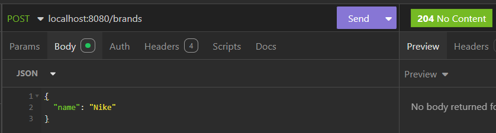
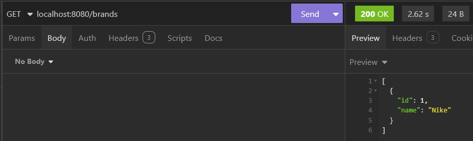
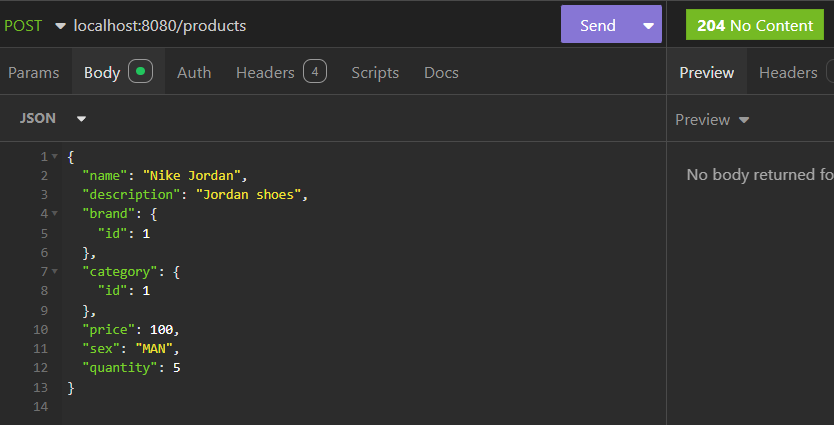
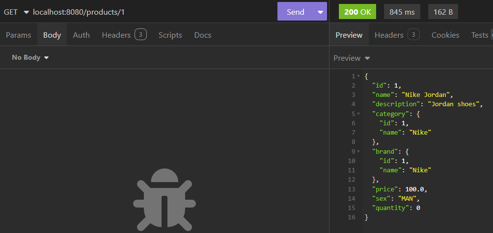
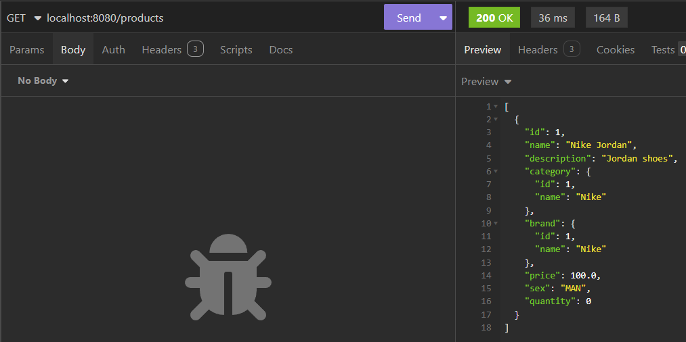

## Описание проекта

REST API для управления школьной базой данных склада с продуктами.

### Используемые технологии

- Java 21
- Sprint Boot 3
- Gradle
- Postgres

### Основные функции

- **CRUD-операции** для следующих сущностей:
- Brands
    - POST
      
    - GET all
      
- Products
    - POST
      
    - GET all
      
    - GET by id
      
      Run infrastructure, which includes database
      From root folder run:
```shell
cd infrastructure/scripts/
sh docker-compose-up.sh
```

Delete infrastructure
```shell
cd infrastructure/scripts/
sh docker-compose-down.sh
```
Run liquibase
```shell
cd service
./gradlew update
```